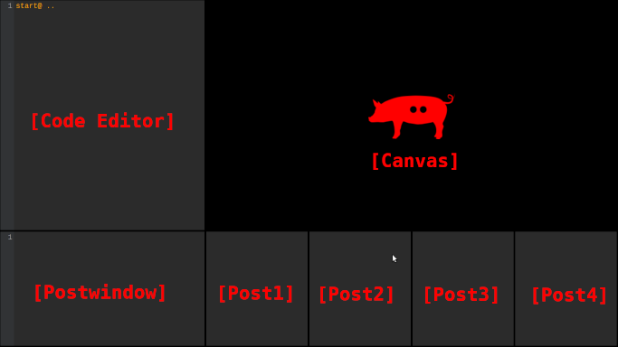

# uPIGr


**Unité Polyagogique Informatique GonzoRobot.**

# About

uPIGr is a javascript editor focused on the creation and live interpretation of audiovisual algorithms.

uPIGr is programmed with:

-  [Tone.js](https://tonejs.github.io/)
-  [P5.js](https://p5js.org/)
-  [Codemirror.js](https://codemirror.net/)

Authors: [Miquel Parera & Gonzorobot](http://gonzorobot.com/)

## Use

### Web

[uPIGr](http://gonzorobot.com/uPIGr.html)

### Localhost (desktop and mobile)

1.Download and unzip the folder: 

[uPIGr folder](http://gonzorobot.com/)

2.Open a terminal in the uncompressed folder an type:

```bash
python3 -m http.server 9000
```

3.Open a navigator and type in the navigator bar

http://0.0.0.0:9000/

## The GUI:




- <span style="color: red;">[Code Editor]</span> : You can edit javascript code here and evaluate with <span style="color: orange;">eval@ code ..</span> and return.
- <span style="color: red;">[Canvas]</span> : You can draw P5.js code here with <span style="color: orange;">draw@ code ..</span> command.
- <span style="color: red;">[Postwindow]</span> : Main information post window.
- <span style="color: red;">[Post1]</span> : For post your information with especial function post1();
- <span style="color: red;">[Post2]</span> : For post your information with especial function post2();
- <span style="color: red;">[Post3]</span> : For post your information with especial function post3();
- <span style="color: red;">[Post4]</span> : For post your information with especial function post4();

## Get started

Control the volume of a oscillator and the size of a ellipse with a loop.

1.Send the sine oscillator:

```javascript
eval@
osc = new Tone.Oscillator(440, "sine").toDestination().start();
osc.volume.value = -120;
size = 0.0;
..
```

2.Draw the ellipse:

```javascript
draw@
fill(color('red'));
ellipse(width/2,height/2,size);
..
```

3.Send the control loop:

```javascript
eval@
loop = new Tone.Loop(function(time) {
  size++;
  vol = upigrMap(size,0.0,300.0,-100,-12);
  osc.volume.value = vol;
  post1(size);
  post2(vol);
  if(size == 300.0){size = 0.0;};
}, 0.125).start(0);
..
```

You can stop the loop:

```javascript
eval@ loop.stop() ..
```

## More info

[uPIGr Manual](http://gonzorobot.com/)

## License

See the [LICENSE](LICENSE.md) file for license rights and limitations (MIT).
